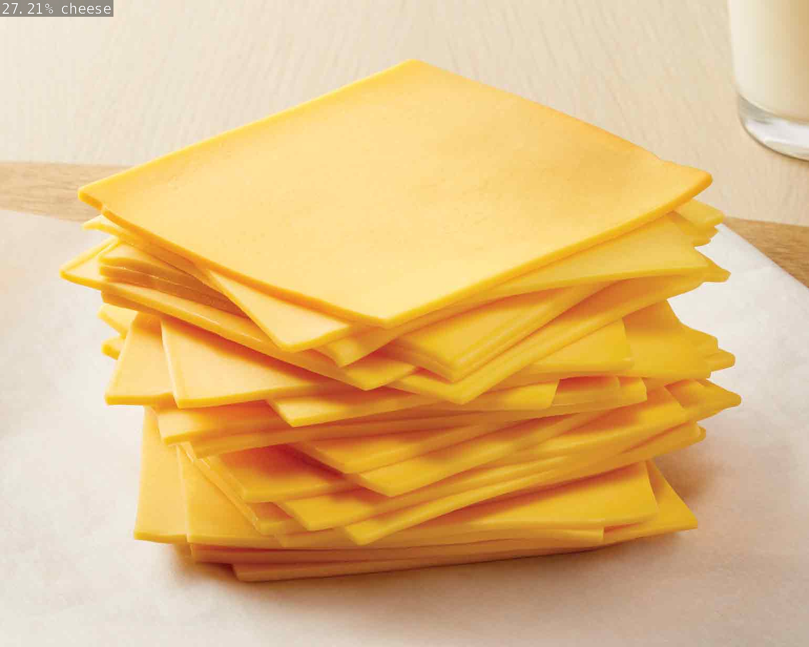

Github #Project

Documentation Paper | Sectionality

Recipe Indentifier

Dataset management sorts through visually identified ingredients to find viable recipes. Ingredients must be out of packaging for the convienence and simplicity of the algorithm.

## The Algorithm

A neuronal algorithm would use logic gates to identify ingredients based off of a hierachical outline of what do expect from certain classes of food. From here the data is transmitted from the ingredient database to identify variables then further extended to a recipe database to find viable recipes from matching the true ingredient variables to the recipe ingredient variable (, recipes could possibly be selective by criterea if time is available).

## Running this project
1. Install JetsonInference          : https://github.com/dusty-nv/jetson-inference/
2. Build the makefile               : cmake .
3. Build my-recognition.cpp         : make
4. Run my-recognition.cpp           : ./my-recognition example.jpg example1.jpg ...
5. Results are listed at the bottem

[View a video explanation here](video link)